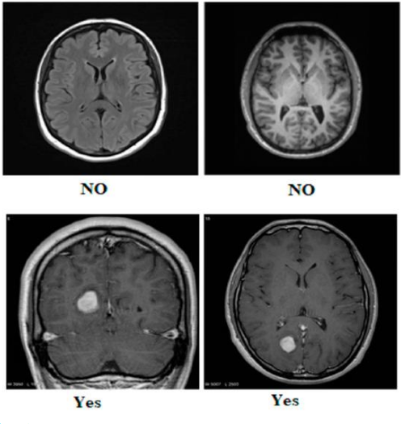

# 🧠 Brain Tumor Classification using Area Attention Mechanism

This project implements a **Brain Tumor Classification** model using a **novel Area Attention Mechanism**. It processes MRI images to classify them as **Healthy** or **Tumor**.

<div align="center">

</div>

---

## 📂 Project Structure

```
📦 Brain Tumor Classification
├── 📜 brain.py       # Main script for image processing and classification
├── 📜 README.md      # Project documentation
```

---

## 🚀 Features

- Uses **MRI images** to classify brain tumors.
- Implements a **novel Area Attention Mechanism**.
- Leverages **NumPy, Pandas, and OS** for data handling.
- Reads MRI image paths and assigns appropriate labels.

---

## 📌 Requirements

Ensure you have the following dependencies installed:

```bash
pip install numpy pandas opencv-python tensorflow keras
```

---

## 🛠 Usage

1. Clone the repository:
   ```bash
   git clone https://github.com/your-repo/brain-tumor-classification.git
   ```

2. Navigate to the project folder:
   ```bash
   cd brain-tumor-classification
   ```

3. Run the script:
   ```bash
   python brain.py
   ```

---

## 📷 Sample Dataset Structure

Ensure your dataset follows this structure:

```
Dataset/
│── Brain Tumor MRI Images/
│   ├── Healthy/
│   │   ├── image_1.jpg
│   │   ├── image_2.jpg
│   │   ├── ...
│   ├── Tumor/
│   │   ├── image_1.jpg
│   │   ├── image_2.jpg
│   │   ├── ...
```

---

## 📖 Explanation

The script:
1. Reads MRI images from a dataset.
2. Assigns labels (`Healthy` or `Tumor`).
3. Processes images for deep learning models.

---

## 🤝 Contributing

Feel free to submit **issues** or **pull requests** to enhance the project!

---

## 📜 License

This project is open-source and available under the **MIT License**.

---

## 💬 Contact
- 🔗 **LinkedIn**: [Shaishav Surati 🇮🇳](https://www.linkedin.com/in/shaishavsurati)
- 🏗️ **GitHub**: [shaishav06](https://github.com/shaishav06)
- 📩 **Email**: [shaishavsurati06@gmail.com](mailto:shaishavsurati06@gmail.com)
